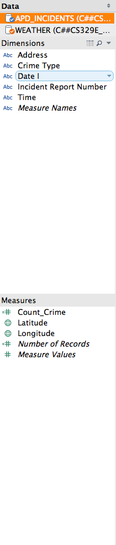
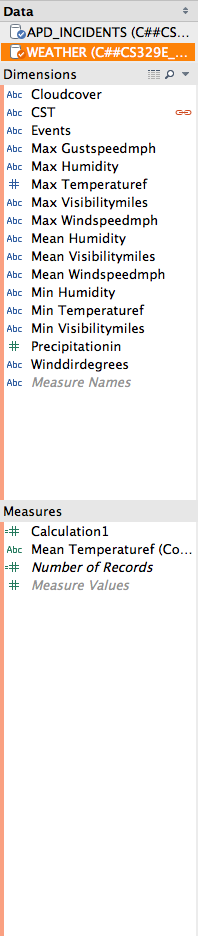
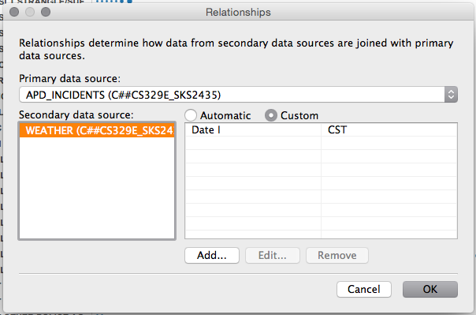
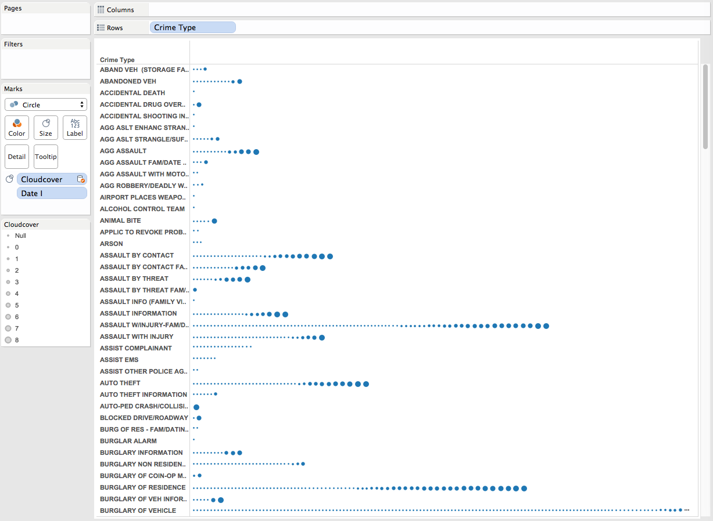
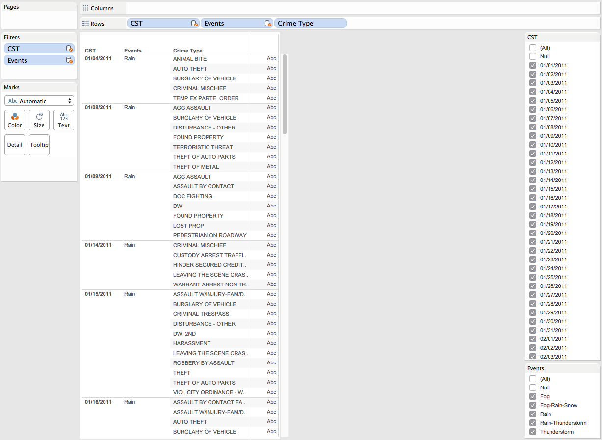
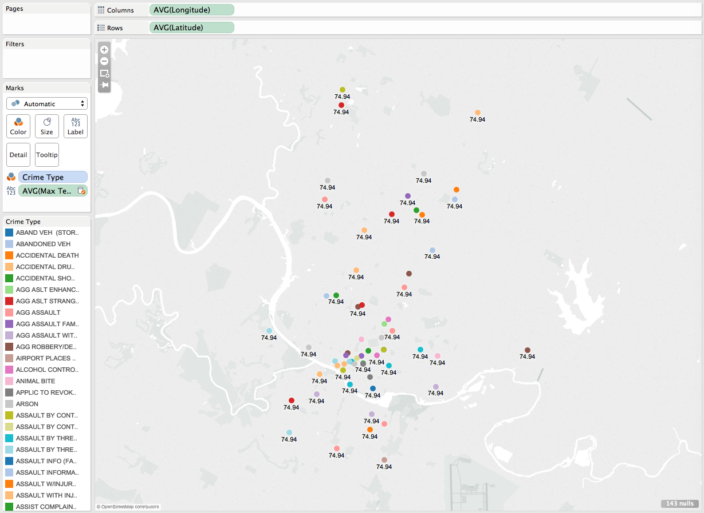
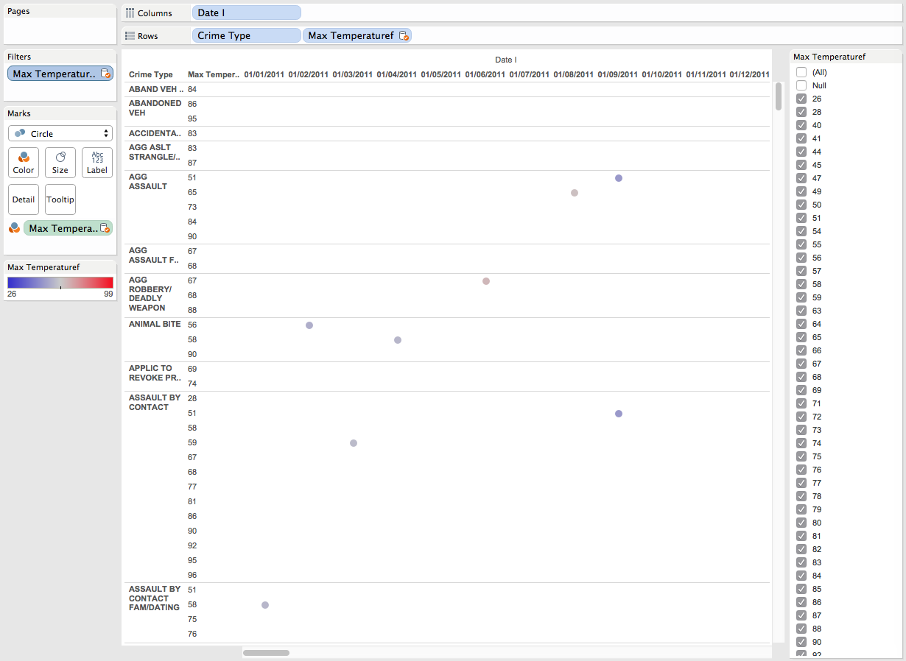

###Project 6 - Blending data sets

Link to repo:
<https://github.com/sarstanc/DV_TableauProject3>

###Two datasets loaded into Tableau from Oracle
APD_INCIDENTS is the primary dataset

WEATHER as the secondary dataset

###Ensure the relationships between datasets is based on the common column - date. (Called Date_I and CST)

###Crime type compared to the amount of cloud cover on each day
More cloud cover is designated by more and larger circles next to each crime.

###Crime types on given days with bad weather
Null values are filtered out so that only crimes committed on days with bad weather are shown.

###Map of Austin showing crime locations and temperature at each
Each location averages to the same temperature since weather data from Austin is taken from a common location.

###Temperature on a given day, organized by crime committed
Points further to the right become more red as the graph moves from January to March.

Filtered out nulls
